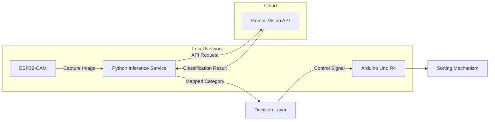

# SORTS — Smart Object Recognition Trash Sorting System

SORTS is an embedded AI prototype that automates waste classification using real-time image recognition and low-cost hardware.

Developed during an MLH hackathon, the system demonstrates a practical integration of computer vision with embedded systems to address real-world sustainability challenges.

 

> [!NOTE]
> This project was developed within a limited hackathon timeframe. The current implementation prioritises proof-of-concept over production robustness.

 

## Overview

SORTS captures images of waste items, classifies them using a vision-language model, and actuates a sorting mechanism to route items into appropriate categories:

- Organic  
- Plastic  
- Paper / Cardboard  
- Other  

The system is designed to operate with minimal infrastructure, using a local network for inter-device communication while relying on cloud AI only for inference.

 

## System Architecture

**Flow Summary**
- The ESP32-CAM captures images and sends them to a Python inference service.  
- The system uses the Gemini Vision API to classify waste items.  
- Classification results are mapped to predefined categories.  
- The Arduino controller executes physical sorting based on the output.

 

## Key Features

- Real-time waste classification using a multimodal AI model  
- Embedded system integration (ESP32-CAM + Arduino)  
- Local network communication for low-latency operation  
- Modular architecture enabling future hardware consolidation  
- Classification across multiple waste categories  

 

## Tech Stack

### Hardware

### Software

### Infrastructure & Tools

 

## Design Considerations

- **Latency vs Accuracy:** Cloud-based inference provides higher accuracy but introduces network dependency.  
- **Hardware Constraints:** Separating sensing (ESP32-CAM) and actuation (Arduino) simplified development within hackathon constraints.  
- **Scalability:** The architecture can be extended to support edge inference or a fully integrated microcontroller-based solution.

Future improvement: Consolidate image capture and actuation into a single ESP32-based system to reduce hardware complexity and cost.

 

## Team

- Naing Htoo Lwin  
- Phone Linn Khant  
- Nadav T Chong  
- Mohammad Ridwaan Joomun  

 

## Motivation

Global waste mismanagement remains a significant environmental challenge. SORTS explores how accessible embedded AI systems can improve sorting efficiency in environments such as schools, public spaces, and smart city infrastructure.

 

## Demo

  

